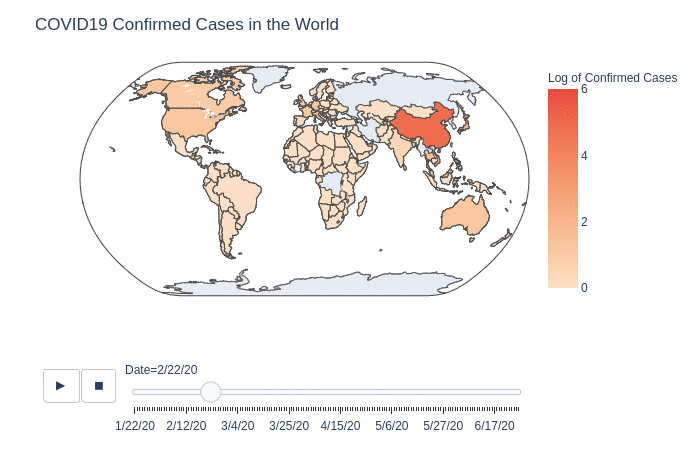

# COVID19-Confirmed-Cases-Time-Series
A Time Series View of all the COVID19 Confirmed Cases in the World

The Website is live [here](https://sifatmd.github.io/COVID19-Confirmed-Cases-Time-Series/).

Dataset is available [here](https://github.com/CSSEGISandData/COVID-19/blob/master/csse_covid_19_data/csse_covid_19_time_series/time_series_covid19_confirmed_global.csv).

---

